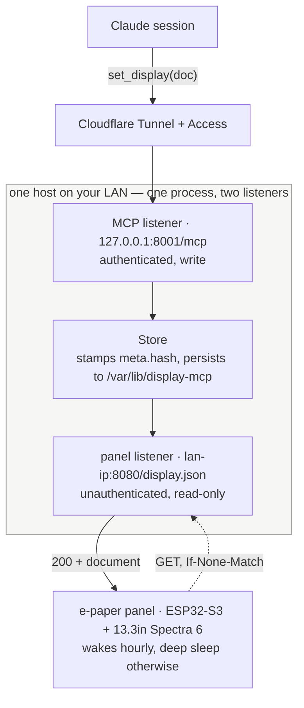
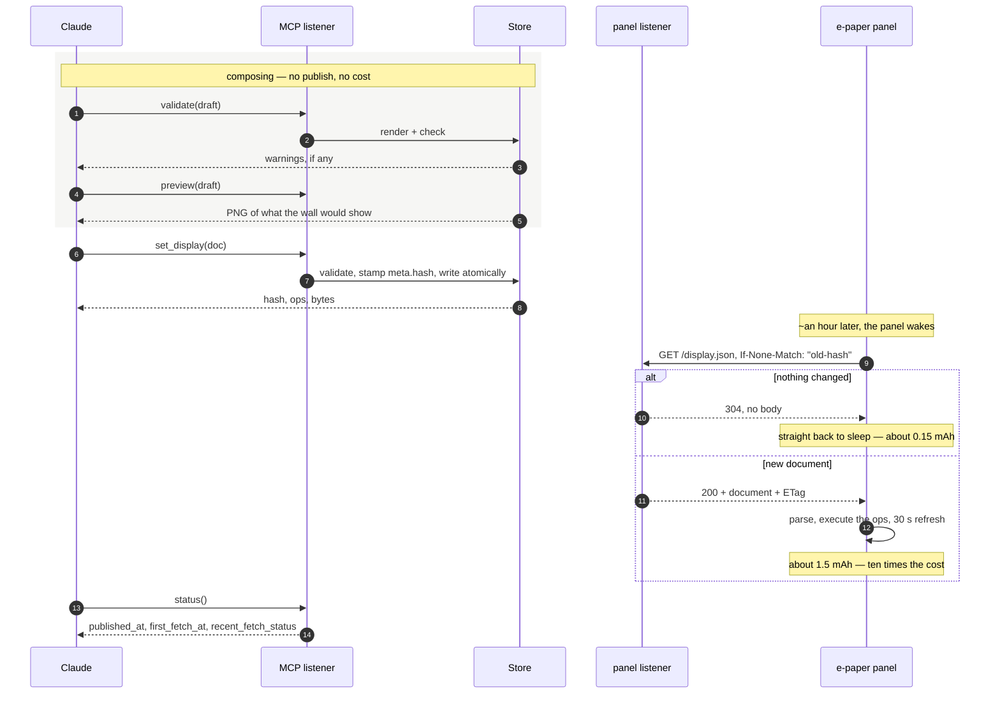

# Summary

I wanted to have claude automations able to generate UI for an eink display I
have.  The display is powered by an esp32 so sending images or html to it
directly wasn't possible; instead, I had claude define a simple JSON markup
language for drawing content.  The esp32 hits a server every hour to fetch
the latest display.json file and render it.

To make this all work for Claude, I created an MCP server that provides some
tools for setting and previewing a display.json.  This runs as a single service
on some server in your LAN.  The MCP server listens on one port and the serving
of the current display.json happens on another.  The MCP server can then be
exposed with oauth (I used cloudflare) and connected to claude allowing any
updates it makes to be seen by the esp32 polling.

# Claude's wordy but correct overview

A 13.3" six-colour e-paper panel on the wall, and an MCP server that lets a
Claude session decide what it shows.

Claude publishes a few KB of JSON describing what to draw. The panel wakes
about once an hour, asks whether anything changed, and goes back to sleep —
usually without drawing, because an unchanged answer costs it a tenth of what
a redraw does. It runs for months on a battery.

<p align="center">
  
</p>

That is [`samples/display.json`](samples/display.json) — 56 ops, 4.4 KB, hash
`21a77f4c46f1534d` — rendered by the same code the preview tool uses. Every op
in the vocabulary appears in it, so it is the best thing to copy and edit.
The vocabulary itself is in [`docs/SPEC.md`](docs/SPEC.md).

## How it fits together



Two listeners on deliberately different interfaces, because they have opposite
threat models. The **write** side is reachable from the internet and every
request carries a Cloudflare Access JWT that the app verifies itself. The
**read** side never leaves your network, is unauthenticated and serves one
static document — the worst case there is a neighbour learning your schedule.

Neither listener is a wildcard bind. Both are explicit addresses, and the
service refuses to start if a wildcard sneaks into the list.

## What a day looks like



`status()` is how a session finds out whether the wall actually caught up.
`recent_fetch_status: 304` is the healthy steady state; a `200` on every wake
while the content looks identical means something is stamping a fresh hash
each time, and the panel is paying a full refresh for nothing.

### The hash is the whole design

`meta.hash` covers `bg` + `palette` + `ops` — deliberately **not** the whole
document, so a new `meta.generated` timestamp costs nothing. The same value is
the ETag. `Store.publish()` is the only thing that stamps it.

That is why the `fmt` op exists: its `{time}` and `{battery}` are substituted
at *draw* time and never appear in the document, so a footer clock does not
invalidate the drawing every minute. A clock in a plain `text` op would cost a
full refresh on every wake — roughly half the battery life.

## The pieces

| | |
|---|---|
| [`src/display_mcp/`](src/display_mcp/) | the service. `store.py` publishes and persists, `panel.py` serves the panel, `mcp_server.py` the six tools, `auth.py` the Access JWT check, `render/` the previewer |
| [`firmware/`](firmware/) | the ESPHome project, and **the source of truth for rendering**. `display_list.h` is the on-device interpreter; where it and the Python renderer disagree, it wins |
| [`docs/SPEC.md`](docs/SPEC.md) | the document language and the contract between the two |
| [`docs/RUNBOOK.md`](docs/RUNBOOK.md) | standing it up, seven steps, a gate on each |
| [`docs/PLAN.md`](docs/PLAN.md) | the design and why it is shaped this way |
| [`deploy/`](deploy/) | the systemd unit and `setup.sh`, which is idempotent and reversible |
| [`mount/`](mount/) | the printed bezel the panel hangs behind, in an ordinary picture frame |

**Six MCP tools.** `set_display` publishes, `preview` renders a PNG so a
session can look before it commits, `validate` checks a draft, `get_display`
reads back what is live, `status` reports whether the panel collected it, and
`clear_display` takes a display down. `compose_display` is a prompt carrying
the op vocabulary and the six-ink design rules, so a scheduled session does
not need the spec pasted into it.

**Two renderers, one vocabulary.** The firmware draws the document on the
panel; `display_mcp.render` draws it as a PNG. They share five font sizes,
eleven icons, six inks and six ops — and nothing else, which is what keeps
"what Claude previewed" and "what the wall shows" from drifting. The wrap and
truncate logic is differentially tested between them.

## Running it

```bash
python -m venv .venv && .venv/bin/pip install -e '.[dev]'
deploy/fetch-fonts.sh ./fonts        # once; gitignored
.venv/bin/pytest

DISPLAY_MCP_FONT_DIR=./fonts DISPLAY_MCP_STATE_DIR=./state .venv/bin/display-mcp
# panel: http://127.0.0.1:8080/display.json    mcp: http://127.0.0.1:8001/mcp
```

The preview needs the same faces the firmware compiles in, or it wraps text in
different places than the panel does — which defeats the point of previewing.

```bash
DISPLAY_MCP_FONT_DIR=./fonts .venv/bin/display-mcp-cli \
  render samples/display.json -o preview.png
```

To put it on a host, [`docs/RUNBOOK.md`](docs/RUNBOOK.md). The edge is a
Cloudflare Tunnel: `cloudflared` dials out, nothing listens on a public port,
and the host needs no address of its own.
