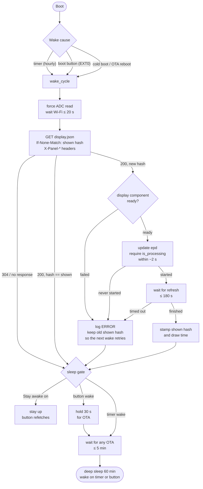

# Wake, sleep, the button, and how the wall got stuck on 2026-09-19

Status: analysed and root-caused 2026-09-19; the sprite allocation fix is committed
in `firmware/display_list.h`; the `wake_cycle` hardening below is still a
recommendation, and a memory audit of the rest of the header followed (see
the end of this file). Evidence is the server
journal on the host (local time), `/healthz`, ESPHome 2026.8.2's own component
sources, the driver pinned at v0.5.0, and two log captures over the native API
taken during this analysis (07:35 and 07:39, both pressing a template button
on the already-awake board).

## What actually happened (all times PDT)

| When | Server saw | What it means |
|---|---|---|
| 07:06:40 | publish, hash `ce83b90b…` | the "BRONTOSAURUS" document: rect, text, poly, sprite, icon, fmt |
| 07:07:25 → 07:08:18 | ten `200` fetches, 6 s apart | ten boots that each fetched and then **reset** before drawing |
| 07:08:18 → 07:13:24 | silence, 5 min 06 s | **ESPHome safe mode**: 10 resets inside 60 s of boot trips it, and it holds for 5 min with only Wi-Fi + OTA up (the API, scripts and display are never set up; `main.cpp` returns before registering them) |
| 07:13:24 → 07:14:16, 07:19:22 → 07:20:17 | ten more, gap, ten more | two more rounds of the same loop |
| 07:21:39 → 07:22:08 | six fetches, 6 s apart | someone reset it 82 s into a safe-mode window; six more crashes |
| 07:22:24 | `200`, draw stamped **07:22:30** | the wake "drew" 6 s after the fetch. A real refresh is 30–40 s. Nothing reached the glass. |
| 07:24:23 | `304` | the panel now believes it shows `ce83b9…` and will never redraw it on its own |
| 07:30:32 | `200`, draw stamped **07:30:35** | your Force redraw (Stay awake on): stamped 3 s after the fetch, again no refresh |
| 07:35:22 | `200`, draw stamped **07:35:25** | my Force redraw while streaming the log: the `dl` line, then **nothing** — no driver init, no error |
| 07:39:57 | `304` | my Fetch and draw: logs "unchanged, but the server sent 200" on a 304 (see stuck mode 4) |

`panel_wakes` stayed at 26 through all of it: `restore_value` globals are only
flushed to flash by the 60 s interval syncer or an orderly shutdown, so a boot
that dies at 6 s never persists its increment. Safe mode's own counter syncs
explicitly, which is why it still tripped.

## Why the glass never changed

`component.update: epd` is ESPHome's `UpdateComponentAction`, and its `play()`
is:

```cpp
if (!this->component_->is_ready()) return;   // silent
this->component_->update();
```

`is_ready()` is false when the component **failed setup**. The driver marks
itself failed for exactly two reasons, both at boot: the 960 KB framebuffer
could not be allocated ("Framebuffer allocation failed"), or the panel did not
answer its init sequence ("Initialization failed", preceded by "BUSY not
released after reset" or an SPI error). Both are logged before Wi-Fi is up, so
they are only visible on serial, never over the API.

The redraw branch of `wake_cycle` does not check any of this:

```yaml
- component.update: epd                       # silently skipped when failed
- wait_until: !is_processing()  timeout 180s  # already false → returns at once
- delay: 3s
- lambda: dl_shown_id = dl_new_id; diag_draw_ts = now   # "drawn"
```

So a failed display produces a wake whose draw stamp lands 3 s after the fetch,
the new hash is recorded as shown, every later fetch is a 304, and the wall is
frozen on the previous image until something clears `dl_shown_id`. Force redraw
clears it but cannot help while the component is failed — only a reboot whose
display setup succeeds can. That is the loop you were in.

Three other paths fall through the same stamp: the driver's own "Display not
ready, cannot schedule update" (ERROR, when the panel fails to wake or re-init
mid-boot), its "No changes detected — skipping refresh operation" (INFO,
`change_detection_mode: track` found no written pixels), and the 180 s
`wait_until` timing out. None of them showed in the 07:35 capture, which is
what points at the failed-setup case: the driver logs those at INFO/ERROR and
the API stream was at DEBUG.

**Why the earlier boots crashed — confirmed from the serial log at 07:49.**
The panel's USB port is the S3's native USB-Serial-JTAG, which is where the
ROM bootloader prints; ESPHome's logger defaults to UART0 on the S3, so
`esphome run` over that port shows only the ROM lines unless you read the
JTAG console (or set `logger: hardware_uart: USB_SERIAL_JTAG`). Read that way,
the crash decodes to:

```
abort() was called at PC 0x4208ed32 on core 1
  __cxa_allocate_exception ← operator new ← std::vector<std::string>::push_back
  ← dl::draw_sprite (display_list.h:675) ← dl::draw_display_list
  ← Display::do_update_ ← EpaperSpectra6133::process_init_stage_ ← loop()
```

`draw_sprite()` parsed the op into `std::vector<std::vector<std::string>>`:
one `std::string` **per cell**. This document's sprite is 96 × 88, so 8,448
strings at ~24 bytes each plus vector growth, roughly 200 KB of *internal*
SRAM on a chip that has about that much free once Wi-Fi and the API are up.
`operator new` failed, exceptions are compiled out, so the chip aborted — on
every wake, six seconds in, until safe mode caught it. The earlier documents
had smaller sprites and fit. It has nothing to do with power or the panel.

Fixed the same morning in `display_list.h`: rows stay as the strings
ArduinoJson already holds and only one row's `(offset, length)` cell table
exists at a time; column count, padding, mirroring, palette lookup and the
run-merged `filled_rectangle` calls are unchanged. The parity harness
(`tests/parity/test_sprite.py`) passes, and a pixel diff of this exact
96 × 88 sprite against the Python renderer — plain, and mirrored with ragged
rows — is zero.

What made the three later boots (07:22, 07:30, 07:35) skip the draw
*silently* instead of crashing was never captured: the 07:48 boot after a
serial reflash set the display up fine. The "verify the draw" change below
stands regardless, because whatever it was, the firmware hid it.

## How it should work



The one rule the diagram adds to today's firmware: **the shown hash advances
only after a refresh demonstrably ran.** Everything else is already there.

## How it works today

- **Boot.** `on_boot` (priority −100, after every component is set up) reads the
  wake cause into `woke_by_button`, bumps `diag_wakes`, runs `wake_cycle`.
  Cold boots and OTA reboots are not button wakes by design.
- **`wake_cycle`** (`mode: single`, so a press mid-cycle is dropped without any
  INFO-level trace): stops any running `sleep_now`, forces a battery read,
  waits for Wi-Fi, fetches with `If-None-Match`. A 200 with a new `meta.hash`
  takes the redraw branch above; everything else logs why and skips. Ends by
  starting `sleep_now`.
- **`sleep_now`**: if Stay awake is on, log "held awake" and return. Otherwise
  hold 30 s if `woke_by_button`, wait for `ota_active` to clear (≤ 5 min), then
  `deep_sleep.enter` — a *forced* sleep that ignores `prevent`, but still
  defers while the boot button is physically held (`KEEP_AWAKE`).
- **`deep_sleep` component**: independently arms a 4 min `run_duration` timer
  at boot. If it fires while `prevent` is set (OTA in progress, or Stay awake
  on) it latches, and the board sleeps on the very next loop after `allow`.
  Turning Stay awake off mid-refresh therefore sleeps mid-refresh.
- **Stay awake**: a persisted template switch (`RESTORE_DEFAULT_OFF` restores
  the last state), so it survives reboots and power cycles. `fetch_and_watch.py`
  turns it on by default and only `--release` turns it off.
- **Boot button**: GPIO0 is both the EXT0 wake pin and a binary sensor. Asleep,
  a press boots the board; awake, a press sets `woke_by_button` and runs
  `wake_cycle`.
- **OTA**: `on_begin` sets `prevent` and `ota_active`; `on_error` clears
  `ota_active`, allows only if Stay awake is off, and re-arms `sleep_now`.
  There is no `on_abort` handler, so an upload whose client just vanishes
  leaves `ota_active` true until the 5 min wait expires.
- **Safe mode** (implicit with `ota: platform: esphome`): 10 boots that reset
  within 60 s → 5 min with only Wi-Fi, OTA and the logger. No fetch, no API, no
  sleep. It is the one window in which a crash-looping board *can* be flashed
  over the air.

## Ways it gets stuck, worst first

1. **Draw not verified** (hit today, three times). Any of: display failed at
   setup, driver "not ready" abort, "no changes" skip, or the 180 s timeout —
   all stamp the hash as shown. Server-side tell: `panel_draw_at` lands within
   ~5 s of a `200` fetch instead of 30–40 s.
2. **Crash loop → safe mode** (hit today, 07:07–07:20). Never sleeps, radio on
   throughout, each round costs ten boots plus five minutes. Recovery is only
   removing the cause, or OTA during a safe-mode window, or serial.
3. **Stay awake left on.** Survives reboots. The board sits up indefinitely and
   never refetches on its own; the only lines that would tell you ("held
   awake") are `logger.log` actions at their default DEBUG level, which this
   INFO-level build compiles out. Same for "woken by button — holding 30 s".
4. **Stale document on a held-awake board.** `wake_cycle` never clears
   `dl_body`/`dl_new_id`, so a 304 or a failed fetch after an earlier 200 logs
   "unchanged, but the server sent 200 — its ETag does not match meta.hash".
   Misleading only, but it is the line that made 07:39 look like a server bug.
5. **No OTA window after a power cycle** — by design; press the button while
   it is awake. Bounded: the 4 min `run_duration` still puts it down.
6. **Button held while it tries to sleep** — `KEEP_AWAKE` defers until release.
   Bounded.

## What to change

Firmware, `wake_cycle`'s redraw branch:

- Clear `dl_body` and `dl_new_id` at the top of every cycle (fixes 4).
- Before `component.update`, fail loudly if `id(epd).is_failed()`.
- After it, `wait_until: id(epd).is_processing()` with a ~2 s timeout, and
  remember whether it started.
- Stamp `dl_shown_id` and `diag_draw_ts` only if it started **and** the long
  wait ended with `is_processing()` false. Otherwise log at ERROR, set
  `diag_result` to something like `200 draw did not run`, and leave
  `dl_shown_id` alone so the next hourly wake gets a 200 and tries again.
- `level: INFO` on the three `logger.log` actions, and one INFO line in
  `on_boot` with the wake cause and `esp_reset_reason()`.

Tooling: `fetch_and_watch.py` should release Stay awake on exit unless told to
keep it, and `--host` should default to something that resolves here (the
uncommitted change already does that).

Server/runbook: flag a `200` whose `panel_draw_at` arrives less than ~15 s
later as "fetched, did not draw" in `status`, and add the row to RUNBOOK's
table. It is the only signal the server has for stuck mode 1.

## To get the wall back right now

1. Reboot the board with the serial log attached, so the display setup lines
   are visible:

   ```bash
   cd firmware && esphome logs epaper-schedule.yaml --device /dev/cu.usbmodem*
   ```

   Look for `Framebuffer ready … PSRAM` and `Display initialized` versus
   `Framebuffer allocation failed`, `BUSY not released after reset`,
   `Initialization failed`, and in safe mode's config dump, `Last reset was due
   to brownout` or `Last reset too quick`.
2. Rebuild with the `draw_sprite` fix and flash it; without it this document
   crashes the panel on every wake.
3. Once a boot reports `Setup complete`, press Force redraw and confirm the
   draw stamp moves 30–40 s after the fetch, not 3.
4. `fetch_and_watch.py --release` so it goes back to sleep.
